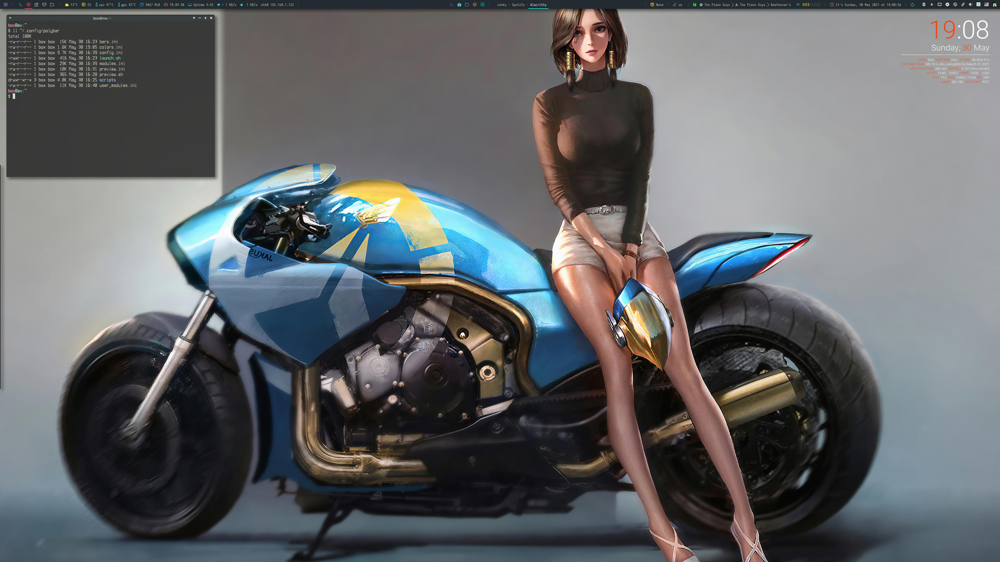
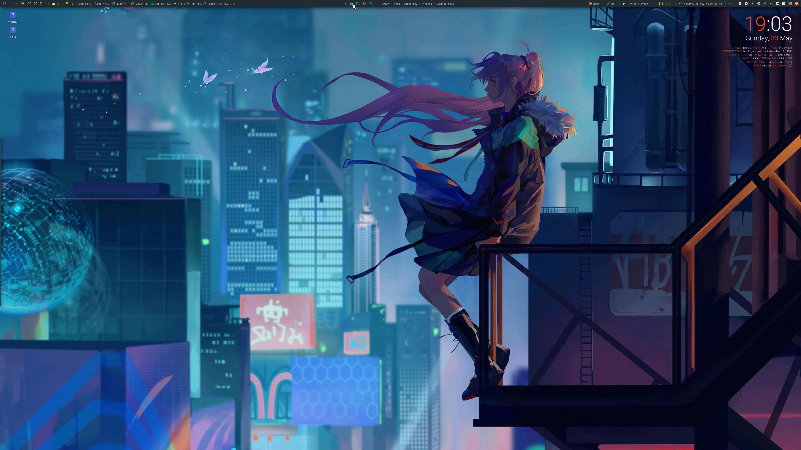

# Advanced Polybar Modules Configuration

Polybar configuration with patched and improved modules for Awesome, i3 and XFCE4. Base design fits to **MX-Linux (Debian Stable) and Arch Distros**.

## Inherited and extended sources

This project configures and extend github polybar sources from

* *polybar-themes (adi1090x)* - forest theme - https://github.com/adi1090x/polybar-themes
* *polywins (alnj)* - https://github.com/alnj/polywins
* *polybar-mpris (0jdxt)* - https://github.com/0jdxt/polybar-mpris
* *dotfiles by Derek Taylor (DT)* - https://gitlab.com/dwt1/dotfiles
* *My personal scripts* and modifications for several modules

## Screenshots



## MAIN GOALs

Inherited actual theme is **Forest** with few styles colormaps from:

https://github.com/adi1090x/polybar-themes/tree/master/simple/forest

Supported all modules already included in the polybar-themes project.

### Added Modules

* **Weather Module** for Open Weather site with Nerd Fonts.
* **MPRIS Module** - with scrolling and activity icon - support all players Spotify, MPD, Youtube, Netflix,...
* **Polywins Module** - Opened application administration support
* **Network Improved Modules**
* **AMD Ryzen and new AMD GPUs Temperatures Modules**
* **Worskpaces Enhanced Module**
* **Update Module** - for MX-Linux and Arch Distros
* **System Module** - for MX-Linux and Arch Distros changed

## Dependencies

Install following programs on your system before you use these themes.

* Polybar : Ofcourse, the bar itself
* Rofi : For App launcher, network, power and style menus
* networkmanager_dmenu : For network modules
* mpris (for spotify and mpd support)

### Fonts

Here's a list of all fonts used by these themes.

**`Text Fonts`**

- Iosevka Nerd Font
- Noto Sans
- Droid Sans
- Terminus

**`Icon Fonts`**

- Iosevka Nerd Font
- Icomoon Feather

### Installation

Follow the steps below to install polybar on your system.

- First, Clone this repository -
```
$ git clone https://github.com/raven2cz/polybar-config
```

- Change to cloned directory and make setup.sh executable -
```
$ cd polybar-config
$ chmod +x .config/polybar/scripts/*
```

- Backup your polybar settings (if you already have).
- Copy dir `.config/polybar` to your `~/.config/polybar` user directory.
- That's it, This polybar is now installed on your system.

### Launch the bar

To launch the bar with the selected theme, Just...

- Open the terminal and enter the following command -
```
$ bash ~/.config/polybar/launch.sh
```

- You can add the same command to your WM *autostart file* to launch the bar on login. For example, to launch the bar at startup on openbox, add following lines in **`$HOME/.config/openbox/autostart`** This polybar is optimized for awesome, fce4, and i3. But it can be used for many others VMs with little modifications.

```
## Launch Polybar
bash ~/.config/polybar/launch.sh
```

### Change colormaps of themes

Right-Click to launcher button (left side first button with rofi), the selector of color maps is started. Select color map.
